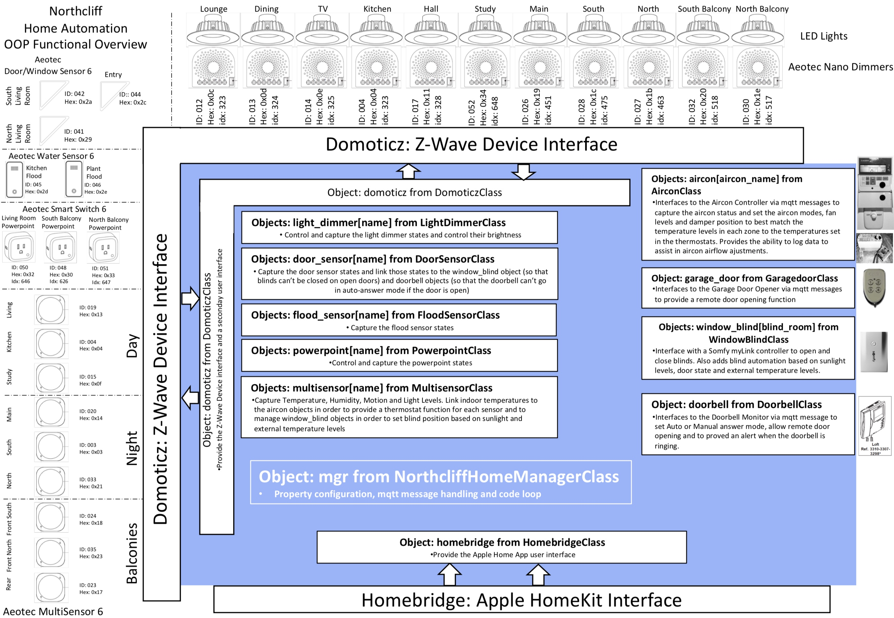

# Home Manager
This is a Raspberry Pi based Home Automation Manager. Utilises mosquitto, Homebridge, Homebridge-mqtt, Domoticz and the projects contained in my other GitHub repositories to automate airconditioning, doorbell, lighting, power outlets, flood sensors, door sensors, window blinds and a garage door opener.

## System Overview

The [System Overview](https://github.com/roscoe81/Home-Manager/blob/master/Documentation/Home%20Automation%20Overview.pdf) shows the four Raspberry Pi based controllers that comprise the system, the mqtt messages that allow them to communicate with each other and the end devices that they manage.

## Home Manager Functional Overview

The [Functional Overview](https://github.com/roscoe81/Home-Manager/blob/master/Documentation/Home%20Automation%20OOP%20Functional%20Overview.pdf) outlines the Python objects of the Home Manager controller and how they interact with Domoticz, Homebridge and the three other controllers that comprise the overall system.

## Aircon Controller
This is a [controller](https://github.com/roscoe81/Aircon-Controller) for a Mitsubishi air conditioner (Model FDC508HES3) to provide mqtt control of the airconditioner using the serial communications link that runs between Mitsubishi's RCD-H-E remote control unit and the CNB port on the air conditioner's control board. Also provides the ability to control a damper so that airflow can be directed to the correct air conditioning zone. An inclinometer is provided for the damper in order to detect its position and control the air flow between zones with greater precision. This Home Manager code captures the actual temperatures of each room, compares those temperatures to desired temperature levels and controls the air conditioner and damper to align the desired and actual temperatures. Room temperatures can be set and monitored by the Apple Home App on an iOS device or via Domoticz.

License
This project is licensed under the MIT License - see the LICENSE.md file for details
